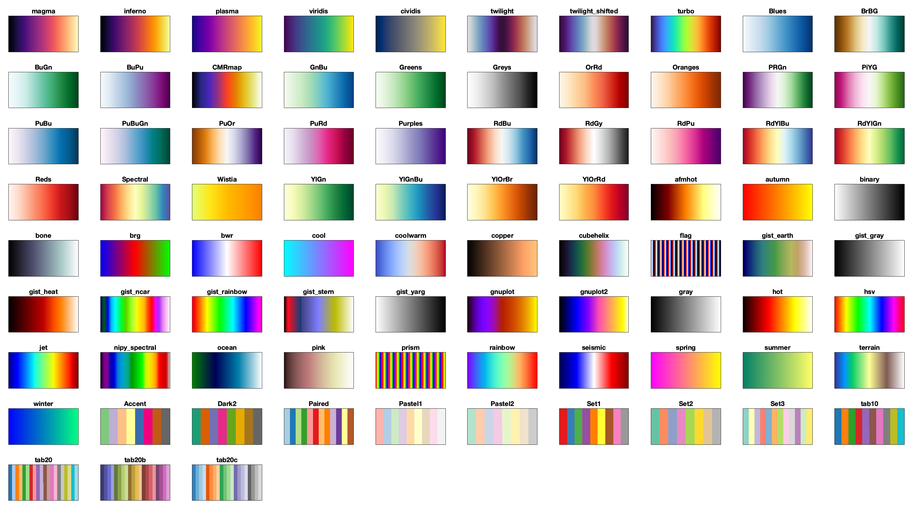

# colormap_matplotlib_matlab
matplotlib colormaps for matlab

Just a small utility to export colormaps directly from matplotlib in python and use them in matlab.

```matlab
cmapnames=colormap_matplotlib('list'); % retrieve list of available colormap names

cmap=colormap_matplotlib('magma'); %retrieve a specific colormap

%example:
figure;
imagesc(rand(10));
colormap(colormap_matplotlib('magma'));
colorbar(gca);

%diverging example. concatenate magma complement (reversed) and magma:
figure;
imagesc(rand(10));
colormap([colormap_matplotlib('magma_comp_r'); colormap_matplotlib('magma')]);
colorbar(gca);
```

By default, the following colormaps are available

(Generated by [example.m](example.m))

Additional complementary versions (hue rotated by 180&deg;) end in "_comp", which can be used to generate new diverging colormaps 

And reversed versions ending in "_r" or "_comp_r"

This list was generated using Python 3.9.13 and matplotlib 3.5.2. If your matplotlib has additional colormaps you would like to include, you can regenerate this file with:
```shell
python save_matplotlib_colormaps.py matplotlib_colormaps.mat
````
